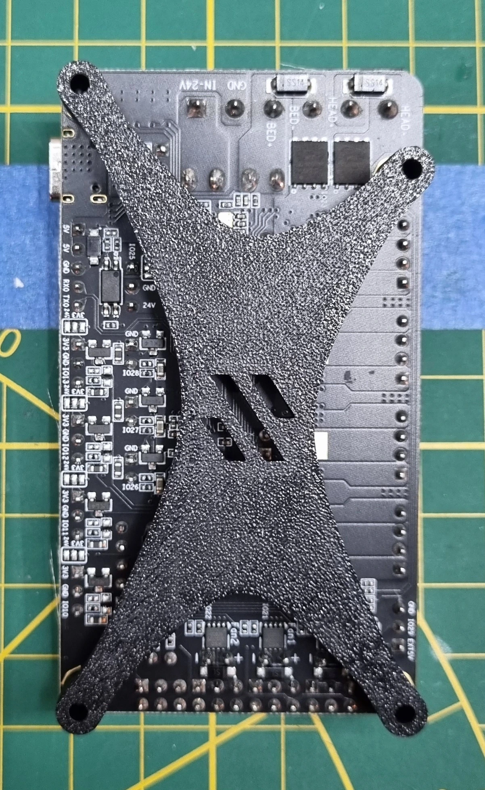

# Fysetc R4 Bracket for V0

This mount can be double-sided taped directly on your V0 backplate to support the tiny Fystec R4 motherboard !
It has the fancy Voron logo !

It only requires 4x M3x6 BHCS screws.
And double-sided tape !

